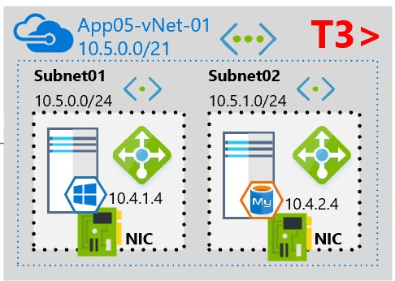

# Azure-vNet
Deploy any number of Azure vNets, along with any number of subnets contained within each of the vNets

Simple but effective & useful template

  

To deploy the most trusted T3 bottom layer of this Azure network:

